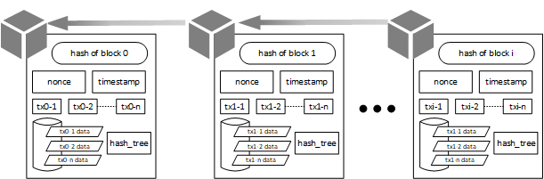
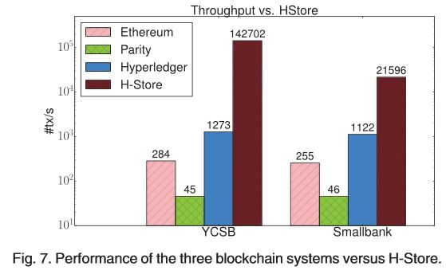

<!-- _paginate: false -->
<!-- _footer: '' -->

<!--  -->

# Blockchain 101
**Thiago Nóbrega**
<https://github.com/thiagonobrega>

<!-- ---

# Agenda

journey
    title Blockchain 101
    section Introdução
        Introdução: 100 : posição
        Características: 100
        Blockchain vs Database: 100
    section Aplicações decentralizadas
        Introdução: 100
        Solidity: 100
        Pratica: 100
    

 -->

---
# Disclaimer
Informações Importantes

---
## O que não vamos aprender

- Crypto ativos
- Valuation
- Balanceamento de Carteira

 

---
<!-- _fit -->
## Concetitos de Criptografia

- Funções Hash
- Assinaturas Digitais

---

<!-- INTRODUÇÃO -->
# Introdução
---

# Blockchain

---

TL;DR
## “Blockchain is a imutable append only transaction log”

---

## Casos de uso

![bg vertical right:30% 80%](data:image/jpeg;base64,/9j/4AAQSkZJRgABAQAAAQABAAD/2wCEAAoHCBIUFRIREhESERIVEhIYEhkZERISEhQZGBgZGRoaGhocIS4lHB4rIRgYNDgmKy8xNUM1HCQ7QDs0Py40NTEBDAwMEA8QHhISHjQrJCs0NDQ0NDQ0NDQ0NDQ0NDQ0NDE0NDQ0NDQ0NDQ0NDQ0NDQ0NDQ0NDQ0NDQ0NDQ0NDQ0NP/AABEIANAA8gMBIgACEQEDEQH/xAAcAAEAAQUBAQAAAAAAAAAAAAAABwEEBQYIAgP/xABDEAACAgADBAQIDQMDBQEAAAAAAQIDBAURBxIhMQZBUWETMlJxgZGSoRYiI0JUYnKiscHC0dKCk7IVU2QXJDND4RT/xAAaAQEAAwEBAQAAAAAAAAAAAAAAAgMEBQEG/8QALxEAAgIBAgMGBgEFAAAAAAAAAAECAxEEIRIxUQUTIjJBYRRxgaHB0TMGUnKRsf/aAAwDAQACEQMRAD8AmYAAAAAAAAAAAAAAAAAAAAAAAAAAAAAAAAAAAAAAAAAAAAAAAAAAAAAAAAAAAAAAAAAAAAAApqAVBQagFQU1KgAAAAAAAAAAAAAAAAAAAAAAAAAAAAAAAAAAA+dliinKTUYpNttpJLtbAPeo1NEz7aLRVrDDRWJsXDe1caV6ecvRw7zUsQ84zHXWF0q5fNSVNH3mlJeds8yZ56mKeI7v2JJzPpdgaG1PERlJfNhrZL07vBelmsYzajWv/DhZz75zjX7o734mHwmzPFy8eyiru+NY16kl7zJV7LH87G+rD/vM88RU56mXJYMbftMxr8WvDwXmlJ++RbPaLmPlVf2l+5mrdlnk4zj34fX8JmMxmzbGx41zqu7lLcl6pcPeeeIpktT7/Y81bScfHxo0TXfXKP4SMvgdqS4K/Ctdrrmpfdlp+JoGPyy/Dy3b6bKn1byai/NLk/QyzPMsrWoti+ZPmT9J8JiuFVy3/IlrCz2Xz9GpmtTmpPRprg0001waa5NPtN86J9PbKnGnGN2VclZxdkPteVH3+c9Uupqq1abxPYloHyqsjOKlGSlGSTi09U0+TTPqTNoAAAAAAAAAAAAAAAAAAAAAAAAKMMwub5rOElRhq1dipLWMW9IVxfDwlr+bHsXN6NLr0HjeCvSDpDRg4KVrblLxIR0dk33L8zU7MpzHM2p4qbwWFejjUuNjXa48NX3y9k2TJujcapvE3zeJxcuMrJJaR+rXH5kV6zYjzGSpwdnn5dP2a/lHRLB4bR10qc18+fyk/Rrwj6NDPlQelsYqKwgAAegoVABb4rC12xcLIRnCS0cZRUov0Mi7pj0E8DGWIwilKpaudWrlKC65QfOS7U+PnJZPLR41kqtqjYsM5qBtHT7I1hcS3BaU3JyguGkXr8eC7k9H/V3GrlZyJwcJNMkLZl0jcZrA2S1hPV0NvxZaauHmaTa79e0lRHNtFsoSjOD0nCUZQfZKLTXvR0NlWMV9NVy5WVwn5t5J6egnFnQ0dnFHhfp/wvQASNgAAAAAAAAAAAAAAABqO0rOLMLgZWUzdVsrKoQklFtavelpqmvFjIh34fZr9Os9mr+JfVp5WRyiUYOR0gDm74fZr9Os9mr+JX4fZr9Os9mr+JZ8HPqiXds6FxVkl8WC1m+Wuu7H60tOaXZ1vTva8ZfgIVKW7rKcnrZOXGdku2T/AAXJLgkkc+fD3Nfp1nsVfxK/D7Nfp1ns1fxHwc+qPO6Z0eNTm/4fZr9Os9mr+Juey/pDj8Xi5RvxU7aYUTnKLjWk5OUYx5RT62QnppQi5NoODSyS7qW+MxlVMXZbZCqC5ynOMIr0vgaR032iVYNyw+GUbsUuEteNdL+tp40vqr0tEMZvnGIxU/CYm6dsurV6Qj3RiuEV5hVppT3eyEYNk35jtQy2puMLLMQ1/tw1j7Umk/RqYl7YcL9ExOn2qf5ELg1rSV+uS3u0TvgNquWzaVnhsO31zr3oL0xb/A3HLszoxEfCUW13Q7YTUkvPpyfczlck/YslGWPufzKa+PplJ/4opu00YxcosjOCSyiZtSpzdHp7mui/76zXTyav4j4e5r9Os9ir+JBaOfVEe7ZKm1jDqWGqs0413pJ9000161H1ESm47PcwxOZ32UY+2WJw8KXPckoxjv78VGXxUnqk5dfWSL8C8t+iV+uf7ma2pxlhswajSynPKZBKJt2cXOeAo15xdsfQrJae7QufgXlv0Sv1z/ci3ppn+JwGLtwmBulhsPXGtqEIwcVKcVOT+Mm9W5doqpc5YR7ptLOE85ROZTU5w+H2a/TrPZq/iXOV9Nc0nfRW8bY1O6qDW5VxUpxTXi95pekmlnKN3ds6HBRFTKVgAAAAAAAAAoypRgEVbcMXpXhKdfGsnY19iO6v82Q8T1066DW5jdXZHEwphXVuKMq3N7zk3J6qS5rd9RrH/Rq76dX/AGJ/yN9F1cK0m9y6MklgiwqbL0z6Kyy6dVc74XSshOXxYOG6k0lrq3rrx9RrRsjJSWUWp53RQAknLdk991VVrxddbsrhNwdMpOG9FS3W97i1qRnZGHmZ5JpcyNjYej/SKWDpxapbjiL1XXGf+1CO85Si/Ke8kuzTU2fNNlUsPVbiLMfWq64SnL5CWukVrovjc2RwRUoWrC3R5lSPUpN6ttttttt6tt82+1nkG29AuiMswtbk3DDVteFmuEpPmoQ73w1fUn3onKSgss9bUUa/lmVYjES3MPTZdLr3YNqP2pcorztG1U7Lc0ktXXTDuldHe+6mveThleWU4auNNFUaq4rgor3t82+98S+RglrJN+FFLsfoc1Zz0NzDCpyuw0/BrnODVsIrtk467q73obhsze5l+b3dkJLX7NUn+pEyNGmdL8BRhMuzJ0QVSui5TUeEXKzcrbS5LVJcF16vrPHqHZHha9UONvZnPpUA6RoJS2G1a242fk10R9uU3+gmNEW7DqdKcZPyra4+zBv9ZKSOTqHm1mafmDObtodu9mWNevK1R9mMY/kdIs5e6TW7+Mxk+e9i8Q15vCy092hbo142/Y9q5mLM30Mp38fgY/8AKpl7ElJ/4mENs2Y072Z4X6rsl6oSX5m614g37F0uR0SVAOMZQAAAAAAAAAAAAAACAdr2L38xlDXhTTVDzNp2P3TRoxnunGJ8Jj8bP/kTj7GkP0mCOzUsQS9jVFbIu8qwjuupoWvyltcOHPSUkm/UzqeuKSSS0SSSXYkc77M8L4TMsItNVCU5y/phLR+04nRZh1svEl0KrXuR/tjx7rwMa4vjffCEvsRUpv3xivSQUTFtx18Fg+zwtmvn3Fp+ZDpo0ixWTq5FDpfoXlEcJg8PSklLcU7H1uclvSb9enmSOaXyfmOsMPZGUYSjxjKMXHzNaor1reIr0I29D6lQDAUlGaXtZs3ctuXlTpj9+L/I3U0DbIn/APgWnJYmre82k/z0LKf5I/MlHmiCAAdk1E5bFqd3A2S8vFTfoUK4/imSGR1sYzGE8HPD6rwlN0nJdbjPSUZeveX9JIpxrv5ZfMyy5nmctE32Jv1HKOLt37LJ+XOcvXJv8zo/prnkMHhLrZSSslCUKVrxlOSajp5ub7kzmtI1aJc38iyr1Bvex2vezDXyMNbL71cP1GiEo7EMI3bi79OEa660++cnJpewvWjRqHipk7PKTIVAOSZgAAAAAAAAAAAAAeXyAOVczt37r7HzndbJ/wBU5P8AMtT6YhfHmvrz/FnzO3Hka0b9sZhrmEn5OFtf36o/qJ3IJ2Ly0x815WDtS/uVP8mTsjmav+VmezzGgbY8vlZgY2R/9F8Jy4fNkpQfvlH1EEs6rzLBwvqsosWsLIShJd0lp6zmXPcpswl9mGtXxoS010aUo/Nku5r811F+jn4XEnU/QxxOeynpRC/DxwdkksRRHdim+Nla0UZLta5NdyfWQYfXDYidc42VzlCcXrGUZOMovtTXI0XVKyOCycco6wDISyba1iq4xhiaIYnTRb8Z+Bsa7ZLRxk/MkZfEbY69Pk8DOT+tdGMfcnqc96a3PIo4JEqSlotW9EufYR9n+ZQzWrMsHhlvxw9Vc4zXHwlqk57sO1JQ0162/XG/SXp5jcYpVymqaHrrXXrFSXZOT4yXdwXcbvsPq+SxlnbbXH2YN/qJuh1Q43z2we8PCssh4G87S+iMsJdLEVR/7W6bkmlwqnJ6uD7It6uPq6uOinQhNTXEi5SyX2U5pfhrI34ex1zj1rRpp84yT4ST7GbstrmYbu74LCOflblv+O/zI7KkZVQnvJBwT5mSzzO8TjJ+FxNrskk1FaJQguekYrgvx7TGFQTSS2R7jBVJvktX1d50Vs8yJ4PBVwnHdts+UuXDVSklpF/ZjurzpmibMeg8pzhj8VBxri97D1yXGcuqck/mrmu16PlzmXQwaq3ifAuRRZLOxUAGMrAAAAAAAAAAAAAAAOY86yTEQxGJjHD3NRvtUWqrJJx35aNNLjw0LL/ScT9GxH9i39jojNqt2evVJa+rgyxOVf8A1NdRZKp1LZ45v6Pl0OjXUpRTTIw2Z030Zhh5ToujGathNyqsjFb0G1q2vKjH1k+pmpRk000+KaZs+GuU4qS61x7u4t0fa3x83xRUWvfOUZ9RVwNM+zNQ6edD4ZhWpRahiq18lNrhJc3Cf1X29T9Ke4A6MZOLyjOng5VzPLLsNZKm+qVdkeaa5rti+Ul3osjqTOckw2Lh4PE0wtjx3dVpKL7YyXGL8xHea7H4NuWFxUq15FkN9eicWml50zoV6uD82xdGxepEAJAs2S5in8WeFkup+Fsi/VuFxhNkOMf/AJcRh619Xwlr9WkS74ir+4l3kSNicti1G7gbJ+XirGu9RhXH8Ys+uSbLMDS1O9zxc1p4/wASrX7Eea7pNm9U0whFQhGMIxWkYxioxiuxJcEY9RqIzXDEqnNNbHjGYSu2E6rIRsrnFxnGS1jJPqZEfSjZTZFysy+SshxfgpyUbI90JvhJfa0feyZTyZ67JVvwkFJrkcs4/J8VQ3G7DW1NeVXJR9EuT9DLSNUnwUW32JNs6slPjuri/wAF2s9RriuKik+3RJmiOuztw/cs7w5tynobmOIa8HhbIxb8ea8FBd+stG15kyUOiey+ihxuxco4m5aOMUmqIvt0fGT8/DuJG0KldmpnNY5EXNs8pHoAoIAAAAAAAAAAAAAAAAAAFjmWH34PTxo8V+aNeNvMJmmB0bnFdrkuzvPn+2tA7F39a3XNe3X6evsbNLdw+BmLL3LsbuPSXivn3d5ZA+bovnRYrK3ujbOCnHDNsi9eKeqZ7NaweOlDh40ez9jNYfG1z5S0fY+DPs9H2lTqFjOJdH+OpzLKJV8+Rdg8no6JSACjAKg8llfmNcNfjbz7F+5VbdXVHisaS9ySi5PCRfFlZiXJ7la3n86XzY/u+4tou27n8nX+P7mRopjBbsVojPG6eo8ixDq+b/xXon1f0XqScVDnu+n7KU1KK7W+bfNs+yCKmuMVFYRXzAAJAAAAAAAAAAAAAAAAAAAAAAFGVABicZlaesq9E+uPU/N2GIshKL0kmn3m2aHznXGS0kk13o4us7FqufFW+F/b/Xp9DTXqZR2lujVihnLcprfGLcfeveW8snfVPX0NHEt7G1cHtFP5NfnBqjqa364LKrF2R8WT9PH8S4jm9i56P0aHv/R5+VD1v9hHJ59c0vWy2qjtWvaKkvqvyzyUtO+eB/rE/JXvPnZmtj693+lfmXcMmj86TfmSRd04GuPKK17XxZuhpO1LNrLeFfPf7fspdlC5RyYeFV1vW2u1tpf/AEyOGyyEdHL40vur0GR0Ghvo7KprlxzzOXWW/wBv3kqnfKSwtl7BIFQdMoAAAAAAAAAAAAAAAAAAAAAAAAAAAAAAAAAKMaFQAU0GhUAFCoAAAAAAAAAAAAAAAAAAAAAAAAAAAAAAAAAAAAAAAAAAAAAAAAAAAAAAAAAAAAAAAAAAAAAAAAAB/9k=)
- E-GOV
    - [b-CPF](https://repositorio.enap.gov.br/handle/1/4727)
    - [Assinatura de Contratos](https://portal.tcu.gov.br/imprensa/noticias/tcu-e-bndes-lancam-rede-blockchain-brasil-e-definem-proximos-passos.htm)
    - [validação de documnetos](https://einvestidor.estadao.com.br/criptomoedas/blockchain-governo-oficializa-uso-para-documentos/)

---

## Casos de uso

- Financial & Commercial Service [1]
    - Nasdaq
    - [Honduran land](https://www.oecd.org/corruption/integrity-forum/academic-papers/Georg%20Eder-%20Blockchain%20-%20Ghana_verified.pdf)
    - Diamond Track

---

## Casos de uso

- Geospatial
    - Secure sharing of geospatial wildlife data (SIGMOD) [2]
    - Geofences UAV (SIGSPATIAL) [3]
- Health System [4-6]
    - Medical records
    - Medical Images
- Smartcity

---
## Curiosidades e Histórico

<!--  -->

https://www.netflix.com/watch/80243756

---

**Quais razoçoes levaram a adoação da Blockchain em tantos cenarios diferentes?**

---
## Caracterísiticas

+ Decentralizado
+ Imutável (_Temper Evident_)
+ Transparente/Auditável
+ Pode ser utilizado por adversarios (_Distrustful Parties_)

---
# Caracterísiticas da rede

---

## Distribuição de dados
<!--  -->

---

## Tipos de rede

**Permissionaria** (permissioned)
> Publicas
> Controle decentralidado
> i.e., cryptomoedas

**Não permissionaria** (permissionless)
> Privadas (ou consorcio)
> Controle centralizado*
> i.e., Banco Central, LACChain

---

# Imutável

---

Estrutura da blockchain

%%{init: {'theme':'neutral'}}%%
graph LR
    block_1 --> block_2
    block_2 --> block_3
    block_3 --> block_4
    block_4 --> block_5
    block_5 --> block_6

---

# Funções Hash
    - distribuição uniforme
    - determinisco
    - resistende a colisão
---

## Hashing

$$ h(x) = x\ mod\ 2^{256}$$

Funções Hash

    - Message Digest (md5)
        - 128 bits
    - Secure Hash Algorithm (SHA)
        - 256 bits

<!-- - Message Digest (md5)
       - 1db76c6493d9bfb050b185239ebee632
    - Secure Hash Algorithm (SHA)
        - 61d520ccb74288c96bc1a2b20ea1c0d5a704776dd0164a396efec3ea7040349d 
-->

[Exemplo da utilização de Hash](https://andersbrownworth.com/blockchain/hash)

---

Estrutura da blockchain

%%{init: {'theme':'neutral'}}%%
graph LR
    block_1 --> block_2
    block_2 --> block_3
    block_3 --> block_4
    block_4 --> block_5
    block_5 --> block_6

---
## Detalhe do encadeamento

[Exemplo do encadeamento](https://andersbrownworth.com/blockchain/blockchain)

---

# Transparente/Auditável

Proveniência/procedencia do dado

---

## Proveniência de dados

1. O quê?
2. Quando?
3. Quem?

---

**Como o blockchain identifica as autores das altarações dos dados?**

---

## Criptografia Assimétrica

---

### Criptografia Assimétrica

> $M \leftarrow mensagem\ \ plana$
> $C \leftarrow mensagem\ \ codificada$
> $chave\_pub \leftarrow chave\ pública$
> $chave\_priv \leftarrow chave\ privada$
> $n \leftarrow tamanho\ da\ chave\ em\ bits$

- **codifique**(M,$chave\_pub$) = $M^{chave\_pub}\ mod\ n$

- **decodifique**(C,$chave\_priv$) = $C^{chave\_priv}$

---

### Assinatura Digital
Assinatura

<!-- mermaid.js -->

sequenceDiagram
    %%{init: {'theme':'neutral'}}%%

    actor Alice
    actor Bob
    participant Blockchain

    autonumber
    note right of Alice: Alice assina um documento na Blockchain
    Alice-->Alice: hash_doc = sha256(doc)
    Alice-->Alice: assinatura = codifique(hash_doc,Alice_priv_key)
    Alice->>+Blockchain: envie(assinatura)
    Blockchain-->>-Alice: documento assinado(alice,doc,assinatura)

---
### Assinatura Digital
Validação da Assinaura

<!-- mermaid.js -->

sequenceDiagram
    %%{init: {'theme':'neutral'}}%%

    actor Alice
    actor Bob
    participant Blockchain

    autonumber
    
    Blockchain->>+Alice: documento assinado(alice,doc,assinatura)
    
    note left of Bob: Como Bob verifica a assinatura de alice?
    Bob->>+Blockchain: get_chave_pub(Alice)
    Bob->>+Blockchain: get_assinatura(doc)
    Blockchain-->>-Bob: alice_pk, assinatura
    Bob-->Bob: hash_doc = sha256(doc)
    Bob-->Bob: hash_doc = decodifique(alice_pk,assinatura)

---

# Distrustful Parties
Algoritmos de consenso

---

---
## Algoritmos de consenso das blockchains

- PoW (Proof of Work)
> Prova de Trabalho
> Miner
> Miners receive block rewards
- PoS (Proof of Stake)
> To become a validator, a coin owner must "stake" a specific amount of coins (i.e., Ethereum 32 ETH)
> validators
> Validators receive transactions fees as rewards
- Proof-Of-Authority (PoA)

---

# Limitadores do uso da Blockchain

---

## Limitadores do uso da Blockchain
Alto custo de aramazenamento
Privacidade dos dados

---

# Blockchain é um tipo de sistema de gerênciamento de dados?

---

# Sim
“Untangling blockchain: A data processing view of blockchain systems"
[8-12]

---

# Tipos de sistemas

**SGBDs tradicionais**
> Mysql, Oracle, Postgres, SQLServer

**SGBDs distribuidos**
> VoltDB, Oracle*, CosmosDB

**Sistemas de arquivo distribuidos**
> HDFS (Apache Hadoop)

---

# Comparativo
|                       | Controle Centralizado | Transparente | Consultas | Storage | T. Falha |
| :--- | :---: |:---: |:---: |:---: |:---: |
**BDs tradicionais** | sim | não | complexas | grande | não |
**BDs distribuidos** | sim | não | complexas | grande | não bizantina |
**HDFS** | sim | não | não | grande | não bizantina |

---

# Comparativo
|                       | Controle Centralizado | Transparente | Consultas | Storage | T. Falha |
| :--- | :---: |:---: |:---: |:---: |:---: |
**BDs tradicionais** | sim | não | complexas | grande | não |
**BDs distribuidos** | sim | não | complexas | grande | n.bizantina |
**HDFS** | sim | não | não | grande | n.bizantina |
**Blockchain** | **não** | **sim** | **chave-valor** | **pequena** | bizantina |

---
## Comparativo de transações por segunto

---

> [9]

---

## Quando não utilizar blockchain
> Restrições quanto ao número de operações por segundo
> Privacidade de armazenamento
> Custo de Armazenamento

---

# Tema do próximo encontro
Como escrever aplicações decentralizadas utilizando Blockchain
